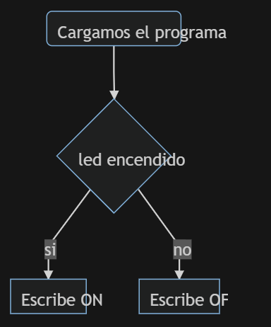
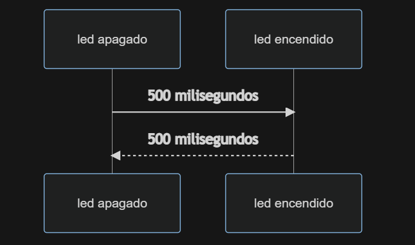

# Práctica 1 BLINK
###### Andrea Muñiz
<p></p>

## Programa + explicación

> Declaramos las cabeceras a utilizar

```
#include <Arduino.h>
```

> Definimos el led que se encenderá

```
#define led 2
```

> Inicializamos el led como salida

```
void setup() {
  Serial.begin(115200);
  pinMode(led, OUTPUT);
}
```

> Creamos un bucle que encenderá y apagará el led cada 500ms y a su vez nos irá informando de cuándo enciende y cuándo apaga dicho led

```
void loop() {
  Serial.println("on");
  digitalWrite(led, HIGH);
  delay(500);
  Serial.println("off");
  digitalWrite(led, LOW);
  delay(500);
}
```
***

## Diagrama de Flujo
> Código para la realización del diagrama de flujo (mediante Mermaid).

```
graph TD;
    A(Cargamos el programa) --> B{led encendido};
    B -->|si| C[Escribe ON];
    B -->|no| D[Escribe OFF];
```


***

## Diagrama de tiempo

> Código para la realizzación del diagrama de secuencia (mediante Mermaid).

```
sequenceDiagram
  participant led apagado
	participant led encendido
	led apagado ->> led encendido: 500 milisegundos
	led encendido -->> led apagado: 500 milisegundos
```


> __Pregunta:__ ¿Cuál es el tiempo libre que tiene el procesador?
El procesador solo tiene el tiempo libre mientras que el led está apagado (500ms) o lo que es lo mismo, el procesador solo trabaja cuando tiene que encender el led y mandar un mensaje al usuario de __ON__ u __OFF__