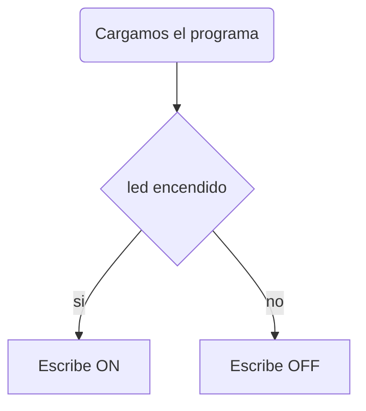

# Práctica 1 BLINK
###### Andrea Muñiz
<p></p>

## Programa + explicación

> Declaramos las cabeceras a utilizar

```
#include <Arduino.h>
```

> Definimos el led que se encenderá

```
#define led 2
```

> Inicializamos el led como salida

```
void setup() {
  Serial.begin(115200);
  pinMode(led, OUTPUT);
}
```

> Creamos un bucle que encenderá y apagará el led cada 1000ms y a su vez nos irá informando de cuándo enciende y cuándo apaga dicho led

```
void loop() {
  Serial.println("on");
  digitalWrite(led, HIGH);
  delay(500);
  Serial.println("off");
  digitalWrite(led, LOW);
  delay(500);
}
```
***

## Diagrama de Flujo


***

## Diagrama de tiempo

